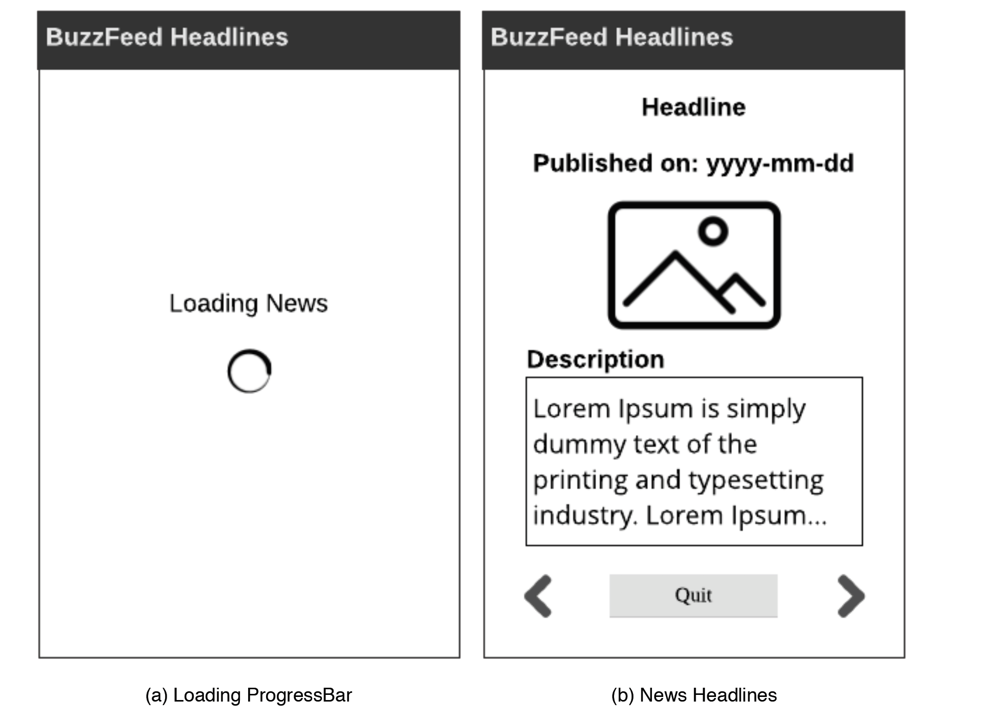

# BuzzfeedTopHeadlines

The App displays news feeds from News API’s Buzzfeed source. Here I learned how to parse JSON
news feeds using Threads/AsyncTasks and dynamic UI management.

Main Activity:
1. Visit News Api webpage, register, and get an API Key. (https://newsapi.org/
register)  
2. Login and visit Buzzfeed API documentation page. (https://newsapi.org/s/buzzfeedapi)  
3. Please go through the example given there.
1. The base API link will be: https://newsapi.org/v2/top-headlines?
sources=buzzfeed&apiKey=<YOUR_KEY>
2. There will be 10 news headlines. 
4. Parsed the articles array.
(a) Loading ProgressBar (b) News Headlines
1. In each item of the array, you will see several attributes, such as author, title,
description, url, urlToImage, publishedAt, and content.
2. Parsed the title, publishedAt, urlToImage, and description. 
5. Created an ArrayList of News objects.
1. Each News object contains title, publishedAt, urlToImage, and
description.   
6. Parsed all the data when the app starts.
1. Displayed a ProgressBar while you parse the data and save it in the ArrayList.
2. Kept all ten news items in ArrayList.  
7. After the items are parsed and saved, displayed the items.
1. TextView 1: put the title.
2. TextView 2: put the publishedAt, e.g, 2018-10-05.
3. ImageView: load urlToImage using Picasso.
4. Large TextView: put the description. 
5. ImageButtons: two ImageButtons are there to browse through the
headlines.
1. Previous button is used to go to the previous news.
2. Next button is used to browse the next news.
3. If it’s the first item in the list, and you press the Previous Button, a toast appears
to let you know the you are on the first item.
 
8. There is a Button to Quit the app

